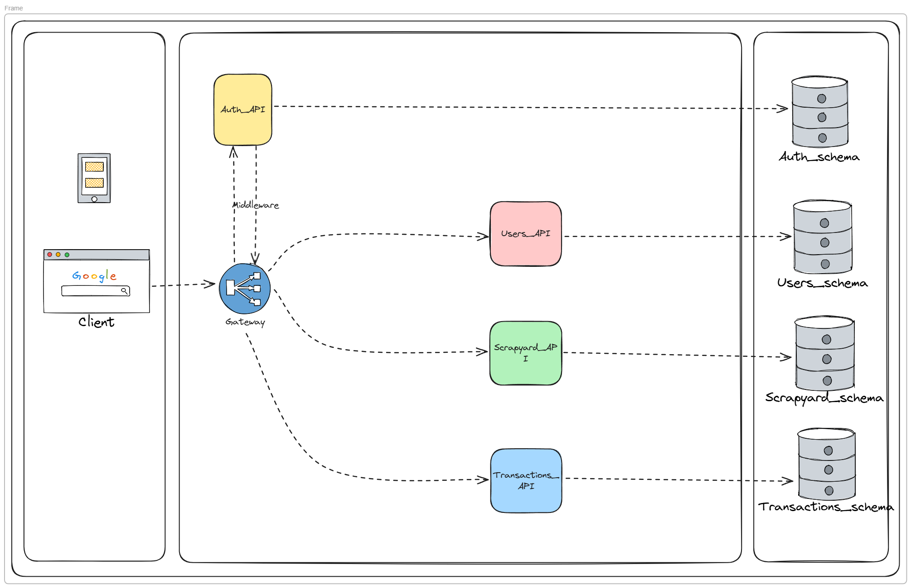

# Diseño de la solución

# Arquitectura de la Solución

La arquitectura de nuestra solucion tendra una arquitectura de microservicios, en la cual cada microservicio se encargara de una parte especifica de la aplicacion.

## Microservicios

### 1. Autenticación

Este microservicio se encargara de la autenticación de los usuarios, permitiendo el registro y login de los mismos.

### 2. Usuarios

Este microservicio se encargara de la gestión de los usuarios, permitiendo la creación, actualización y eliminación de los mismos.

### 3. Chatarrerías

Este microservicio se encargara de la gestión de las chatarrerías y los materiales que aceptan, permitiendo la creación, actualización y eliminación de los mismos.

### 4. Transacciones (Órdenes de Venta de Chatarra y Recolección)

Este microservicio se encargara de la gestión de las transacciones, permitiendo la creación, actualización y eliminación de las mismas.